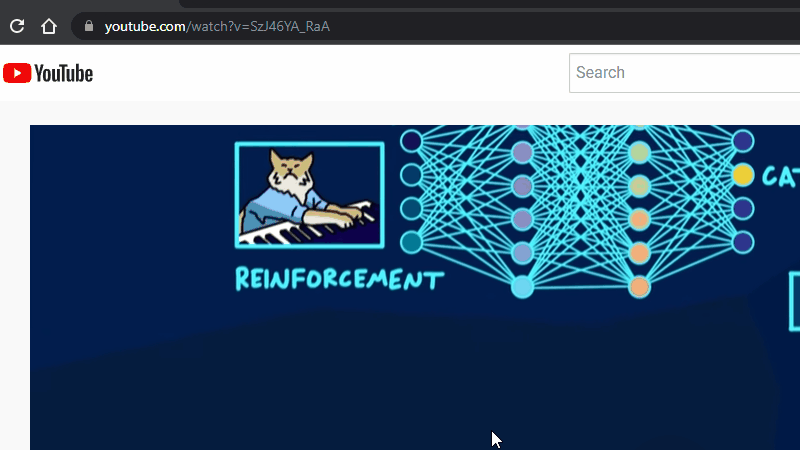
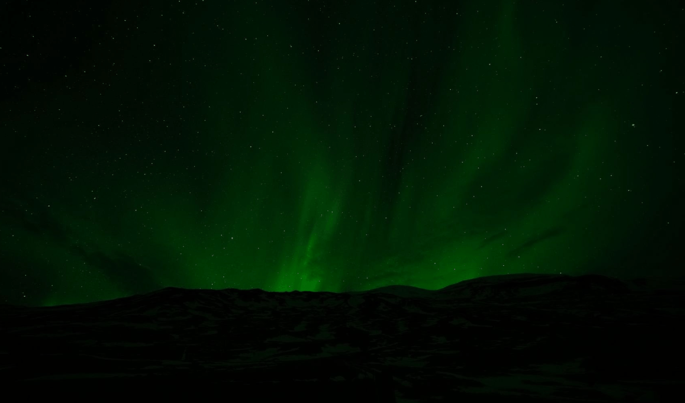
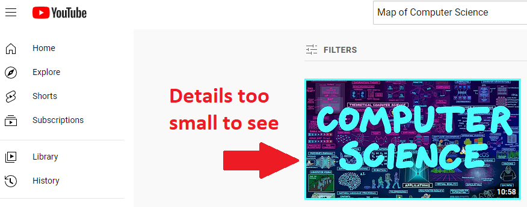

# YouTube Video Thumbnail Magnifier
Viewing high quality YouTube video thumbnail is as easy as 1-2-3!

## Step 1) Copy Video URL

## Step 2) Paste URL in Prompt

## Step 3) View Magnified Thumbnail

## Issues Addressed
### Curious to see the thumbnail details?
Some details are too difficult to see.

### What about zooming in?
Using your browser to zoom-in to the thumbnail introduces image distortion. Can’t see the details clearly.

